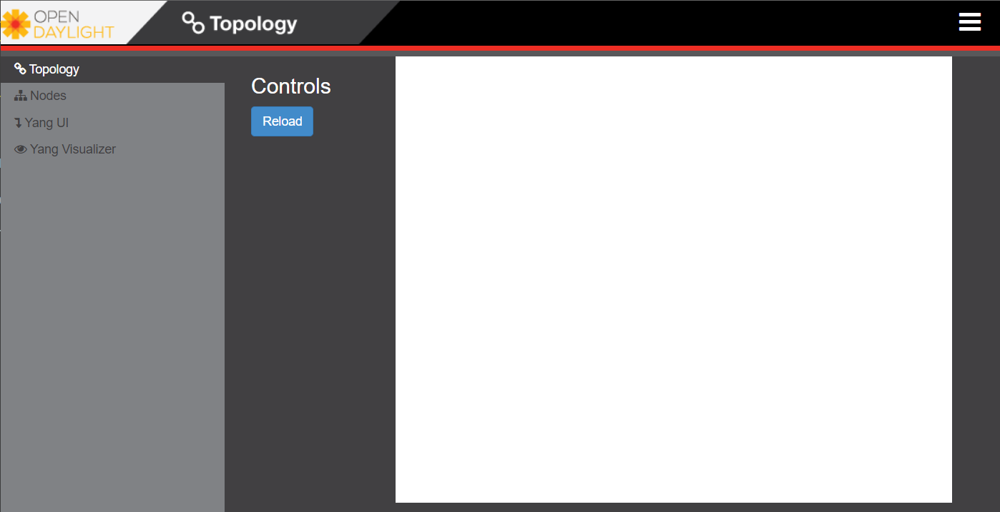

# SDN Testbed Setup 
## Technology Stack & Deployment Diagram 


## Network Diagram


# OpenDaylight VM
The ODL VM needs to be configured from a Ubuntu 22.04 LTS server base image
## Step1: Download a Base Image
Download Ubuntu 22.04 LTS server image from: https://releases.ubuntu.com/jammy/ubuntu-22.04.3-live-server-amd64.iso

## Step2: Configure Static IP
configure static ip `192.168.200.101/24` in file `/etc/netplan/01-installer-config.yaml`
```yml
network:
    version: 2
    renderer: networkd
    ethernets:
        ens33:
            addresses:
                - 192.168.200.101/24
            nameservers:
                addresses: [8.8.8.8, 8.8.4.4]
            routes:
                - to: default
                  via: 192.168.200.2
```
apply settings 
```bash
sudo netplan apply
```
## Step 3: Install Java 8 Runtime
```bash
sudo apt -y install openjdk-8-jre
```
## Step 4: Run ODL Berrylium SR4 
1. Download ODL precompiled package 
    ```bash
    wget https://nexus.opendaylight.org/content/repositories/public/org/opendaylight/integration/distribution-karaf/0.4.4-Beryllium-SR4/distribution-karaf-0.4.4-Beryllium-SR4.tar.gz
    ```
2. Unzip and rename 
    ```bash
    tar -xvf distribution-karaf-0.4.4-Beryllium-SR4.tar.gz    # unzip
    mv distribution-karaf-0.4.4-Beryllium-SR4 odl             # rename
    ```
3. Run ODL
    ```bash
    ./odl/bin/karaf
    ```
## Step 5: Preprare ODL 
Run the `odl_start.sh` that contains a script that runs builds/start the following ODL features:
| Feature | Purpose |
|--|--|
| dlux | DLUX Web GUI runs on Port 8181 |
| l2switch | OF listener for L2 Switch runs on Port 6653 |
| mdsal | Model Driven Service Abstraction Layyer to render YANG data models |
| netconf | NETCONF server |
| restconf | RESTCONF server | 
| openflowplugin | for remote config by Cisco OFM |  
<br>

```sh
# odl_start.sh
echo feature:install \       
        odl-dlux-all \
        odl-l2switch-all \ 
        odl-mdsal-all \ 
        odl-netconf-all \ 
        odl-restconf-all \ 
        odl-openflowplugin-all \ 
| ./odl/bin/karaf
```
The process will take long while builing the features for the first time. Perhaps check logs:
```
tail -f odl/data/log/karaf.log
```

## Step 6: Verify ODL GUI
Browse to http://192.168.200.101:8181/index.html page, ODL login page show up. Use credentials `admin/admin`.<br>


ODL DLUX dadhboard will look like below, the topology screen is empty as no dataplane has been prepared yet. 



# Cisco Opendaylight OpenFlow Manager 
## Clone from Ubuntu Base 
Clone an Ubuntu VM from the base Snapshot as of the ODL VM. 

## Static IP configuration 
configure static ip `192.168.200.103/24` in file `/etc/netplan/01-installer-config.yaml`
```yml
network:
    version: 2
    renderer: networkd
    ethernets:
        ens33:
            addresses:
                - 192.168.200.103/24
            nameservers:
                addresses: [8.8.8.8, 8.8.4.4]
            routes:
                - to: default
                  via: 192.168.200.2
```
apply settings 
```bash
sudo netplan apply
```
## Prepare OFM VM 
1. Install git 
    ```bash
    sudo apt -y install git 
    ```
2. Clone OFM repo 
    ```
    git clone https://github.com/CiscoDevNet/OpenDaylight-Openflow-App.git
    ```
3. Rename to OFM
    ```
    mv OpenDaylight-Openflow-App OFM
    ```
4. Install __Node.JS__ and __NPM__
    ```
    sudo apt -y install nodejs npm
    ```
5. Install __Grunt__ using __NPM__
    ```
    npm install -g grunt-cli
    ```
6. Set ODL IP in OFM config
    Edit `OFM/ofm/src/common/config/env.module.js` file and set ` baseURL: "http://192.168.200.101:"`
7. Run `run_ofm.sh` file to start the grunt server or run the following commands:
    ```bash 
    cd OFM/ofm
    grunt
    ```

# Mininet VM 
## Step 1: Download VM: 
The Mininet VM comes prebuild, therefore just set the static IP and run a simple topology to test the stack.

1. Download the VM from here: https://github.com/mininet/mininet/releases/download/2.3.0/mininet-2.3.0-210211-ubuntu-20.04.1-legacy-server-amd64-ovf.zip 
2. Unzip and load VM to a Hypervisor 

## Step 2: Static IP Config 
configure static ip `192.168.200.102/24` in file `/etc/netplan/01-netcfg.yaml`
```yml
network:
    version: 2
    renderer: networkd
    ethernets:
        eth0:
            addresses:
                - 192.168.200.102/24
            nameservers:
                addresses: [8.8.8.8, 8.8.4.4]
            gateway4: 192.168.200.2
```
apply settings 
```bash
sudo netplan apply
```
## Step 3: Run a simple topology
Run the `test_run.sh` file containing the fillowing script:
```bash
CONTROLLER_IP=192.168.200.101                                         # OLD IP 
CONTROLLER_PORT=6653                                                  # OF Port 
sudo mn --switch=ovsk,protocols=OpenFlow13 \                          # set switch type and OF proto version
        --controller=remote,ip=$CONTROLLER_IP,port=$CONTROLLER_PORT \ # set controller type, ip and port
        --topo=linear,4 \                                             # set topology 
        --mac                                                         # set sequential host MAC addr
```
The script runs mininet program with additional parameters. 

# Verify 
## Boradcast 
Openflow is a ractive protocol, therefore it requires a broadcast in the network to discover all devices. in the `mininet>` prompt type `pingall` command to do so 
```bash 
mininet> pingall
*** Ping: testing ping reachability
h1 -> h2 h3 h4
h2 -> h1 h3 h4
h3 -> h1 h2 h4
h4 -> h1 h2 h3
*** Results: 0% dropped (12/12 received)
```

## Verify topology on ODL DLUX GUI


## Verify topology from OFM 
